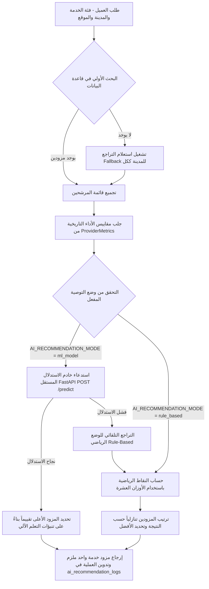

# دليل نظام التوصيات الذكي لمزودي الخدمة (AI-Ready Service Provider Recommendation System)

> [!NOTE]
> هذا النظام هو عبارة عن هيكلية **AI-Ready (جاهزة للذكاء الاصطناعي)** مصممة ومخصصة كنموذج عملي متقدم لمشاريع التخرج والبيئات التجريبية. النظام يدمج بين القواعد الرياضية المتينة والتعلم الآلي عبر استدعاء نموذج مدرب، مع آلية تراجع ذكية تضمن استمرارية الخدمة بنسبة 100% في البيئة التشغيلية.

---

## 📌 وظيفة النظام (System Functionality)

يقوم نظام التوصيات بمطابقة طلب العميل لإصلاح أو سحب سيارته جغرافياً وفنياً مع أفضل مزود خدمة متاح ومناسب في قاعدة البيانات. يهدف النظام إلى تحقيق التوازن بين:
1. تقليل المسافة وزمن الوصول للعميل.
2. ترشيح المزود الأكثر جودة وخبرة والتزاماً لضمان رضا العميل.
3. التوزيع العادل والمناسب لطلبات الخدمة بناءً على الطاقة الاستيعابية وساعات العمل الفعلية للورش.

---

## 🔄 طريقة العمل الحالية (Current Workflow)

يسير طلب التوصية عبر الخطوات التالية عند استدعاء الواجهة الخلفية:



1. **تصفية الاستبعاد:** يقوم النظام أولاً باستبعاد أي ورش تم تحديدها في حقل `excludeProviderIds` لمنع إعادة ترشيح ورشة فشل معها الطلب سابقاً.
2. **الاستعلام الأولي:** يبحث النظام عن المزودين النشطين والمعتمدين الذين يطابقون المدينة وفئة الخدمة المطلوبة.
3. **استعلام التراجع (Fallback Query):** في حال عدم العثور على أي ورشة متخصصة، يتم تشغيل استعلام بديل يبحث عن أي ورش عامة نشطة في نفس المدينة لمنع فشل الطلب.
4. **جلب البيانات الإحصائية:** يتم استخراج سجل الأداء التاريخي للورش المرشحة من جدول `provider_metrics`.
5. **حساب التقييم والتوصية:** يتم فرز الورش واختيار **مزود خدمة واحد فقط ملزم للعميل** بناءً على النموذج المفعّل. إذا تم تفعيل وضع التعلم الآلي `ml_model` وجاهزية البيئة، يتم إرسال طلب HTTP POST سريع جداً إلى خادم FastAPI المستقل.
5. **التسجيل الذكي (Logging System):** يتم تدوين تفاصيل الطلب، الميزات المدخلة، قائمة الترشيحات الكاملة بنقاطها التفصيلية، والنموذج المستخدم في جدول `ai_recommendation_logs` لأغراض التحليل وتدريب النموذج لاحقاً.

---

## 📊 الفرق بين وضع القواعد (Rule-Based) والتعلم الآلي (ML Model)

| وجه المقارنة | وضع القواعد (Rule-Based) | وضع التعلم الآلي (ML-Model) |
| :--- | :--- | :--- |
| **آلية العمل** | يعتمد على أوزان ثابتة ومحددة يدوياً من ملف الإعدادات تتوزع على 10 معايير. | يعتمد على نموذج `RandomForestClassifier` مدرب على توقع احتمالية اختيار العميل للمزود. |
| **المرونة** | ثابت ولا يتغير إلا بتعديل يدوي لملف الإعدادات البرمجية. | ديناميكي، يتعلم من سلوك واختيارات العملاء الحقيقية بمرور الوقت. |
| **الاستدعاء الفني** | حسابات رياضية سريعة ومباشرة داخل بيئة عمل Node.js. | استدعاء HTTP REST API سريع لخادم FastAPI المستقل على منفذ 8000. |
| **التراجع والأمان** | هو خط الدفاع الأخير والوضع الافتراضي عند حدوث أي خلل. | يتراجع تلقائياً لوضع القواعد في حال توقف خادم FastAPI أو حدوث أي خطأ في الاتصال. |

### معايير التقييم العشرة المعتمدة (10-Criteria):
* المسافة الجغرافية (Haversine).
* التقييم والجودة (Bayesian Rating).
* مستوى تطابق تصنيفات الخدمة.
* التوافق مع ساعات العمل.
* دعم الطوارئ 24/7.
* سرعة الاستجابة المتوقعة بالدقائق.
* حجم الطلبات المكتملة تاريخياً.
* انخفاض معدل إلغاء الطلبات.
* تطابق المدينة جغرافياً.
* التوافق مع مستوى استعجال الطلب.

---

## 🧪 البيانات الوهمية وتشغيل الـ Seeds

لتوليد بيئة إحصائية غنية وواقعية تحاكي تشغيل النظام الفعلي لعدة أشهر مضت، تم تزويد المشروع بسكربتات توليد بيانات تاريخية ضخمة:

### 1. توليد الطلبات التاريخية والعملاء والتقييمات:
يقوم السكربت بتوليد **500** عميل، **25,000** طلب تاريخي موزع جغرافياً وزمنياً على مدار سنة مضت، و **5,000** تقييم مفصل باللغة العربية، بالإضافة لتحديث إحصائيات الـ **1785** مزود خدمة حقيقي في قاعدة البيانات.
* **الأمر للتشغيل:**
  ```bash
  # من مجلد الباك إند الرئيسي
  node scripts/seed-historical-data.cjs
  ```

### 2. احتساب وحقن مقاييس الأداء للمزودين (Provider Metrics Seeder):
يقوم السكربت بقراءة كافة الطلبات والتقييمات المولدة حديثاً واحتساب متوسط زمن الاستجابة، ونسب الإلغاء، وأداء ساعات الذروة، ونقاط التخصص الفعلي لكل ورشة وحقنها في جدول `provider_metrics`.
* **الأمر للتشغيل:**
  ```bash
  node scripts/recalculate-provider-metrics.cjs
  ```

---

## 🚂 طريقة تدريب وتشغيل خادم الاستدلال (Model Training & Serving)

تم تزويد النظام ببيئة تدريب وخادم استدلال متكامل بلغة بايثون داخل مجلد `ai-training`:

### 1. تدريب النموذج (Model Training):
1. يقوم سكربت التدريب [train_model.py](file:///e:/all_project/CarHero/CAR_HERO_BACKEND/ai-training/train_model.py) بقراءة سجلات التوصية الحقيقية من قاعدة البيانات كخيار أول.
2. في حال عدم وجود سجلات كافية، يقوم تلقائياً بإنشاء **15,000** سجل تفاعلي تركيبي متوازن.
3. يقوم بتدريب نموذج تصنيف غابات عشوائية (`RandomForestClassifier`) بنسبة تقسيم 80/20.
4. يصدر تقرير تقييم الأداء في [evaluation_report.md](file:///e:/all_project/CarHero/CAR_HERO_BACKEND/ai-training/evaluation_report.md) ويحفظ النموذج في `models/provider_recommendation_model.pkl`.

* **خطوات التشغيل والتدريب:**
  ```bash
  # الانتقال لمجلد التدريب
  cd ai-training
  
  # تشغيل التدريب وتوليد النموذج
  python train_model.py
  ```

### 2. تشغيل خادم الاستدلال المستقل (FastAPI Microservice):
لضمان أداء استجابة فائق السرعة وجاهز للإنتاج، يعمل خادم FastAPI محلياً على منفذ `8000` ويحتفظ بالنموذج محملاً بالكامل في الذاكرة.
* **أمر التشغيل:**
  ```bash
  # من داخل مجلد ai-training
  python -m uvicorn main:app --host 127.0.0.1 --port 8000
  ```
  بعد التشغيل، ستجد توثيق الـ Swagger التفاعلي للخدمة الميكروية متاحاً مباشرة على: `http://127.0.0.1:8000/docs`

### 3. التدريب المؤتمت وإعادة التحميل الذاتي (Automated Retraining & Hot-Reloading):
لضمان استمرار تعلم النظام وتطوره الذاتي دون تدخل بشري، تم بناء دورة متكاملة للتدريب التلقائي والتحديث المباشر للنموذج:
* **الجدولة التلقائية (Cron Job):**
  تحتوي الخدمة `ModelRetrainingService` على مهمة مجدولة أسبوعياً (`@Cron('0 0 * * 0')` كل يوم أحد في منتصف الليل) تقوم بالآتي:
  1. التحقق من حجم البيانات الجديدة في جدول `ai_recommendation_logs` (يتطلب 200 سجل على الأقل للتدريب الفعلي، وفي حال النقص يتم التدريب بالبيانات التركيبية كبديل).
  2. تشغيل سكربت بايثون `train_model.py` كعملية فرعية لتحديث ملف النموذج `provider_recommendation_model.pkl`.
  3. بعد نجاح السكربت، يتم إرسال إشارة للـ FastAPI عبر استدعاء نقطة الوصول `POST /reload`.
* **إعادة التحميل بدون توقف (Zero-Downtime Hot-Reload):**
  يحتوي خادم FastAPI على مسار مخصص `POST /reload` يعيد تحميل ملف النموذج المحدث من القرص إلى الذاكرة العامة فوراً، مما يضمن استمرارية الخدمة بنسبة 100% ودون الحاجة لإعادة تشغيل السيرفر.
* **التشغيل اليدوي للمسؤولين (Manual Admin Trigger):**
  تم توفير واجهة برمجية للمشرفين لإطلاق عملية إعادة التدريب يدوياً وتحديث خادم الاستدلال فوراً:
  - **المسار:** `POST /api/v1/admin/ai-recommendations/retrain` (أو `POST /admin/ai-recommendations/retrain` حسب البادئة العامة).
  - **الحماية:** يتطلب رمز المصادقة `JWT-auth`.
  - **الاستجابة:**
    ```json
    {
      "success": true,
      "logCount": 150,
      "fallbackUsed": true,
      "message": "Model retrained and loaded successfully by AI service.",
      "output": "...[سجلات مخرجات سكربت بايثون]..."
    }
    ```

---

## 🎛️ إعدادات الربط وتحديد مسار خادم الذكاء الاصطناعي

يتم ضبط طريقة التوصية والربط عبر ملف الإعدادات الخاص بالباك إند [.env](file:///e:/all_project/CarHero/CAR_HERO_BACKEND/.env):

```env
# تفعيل وضع التوصية: ml_model (تعلم آلي) أو rule_based (قواعد رياضية)
AI_RECOMMENDATION_MODE=ml_model

# رابط خادم استدلال FastAPI المستقل (Microservice URL)
AI_SERVICE_URL=http://localhost:8000
```

> [!TIP]
> لا يتطلب تغيير هذا المتغير إعادة بناء المشروع، وتكفي إعادة تشغيل السيرفر لتطبيق التغيير. في حال تفعيل `ml_model` وعدم توفر بيئة بايثون أو ملف النموذج بشكل صحيح، سيكتب النظام تحذيراً في السجلات ويتراجع تلقائياً لوضع `rule_based` لضمان عدم توقف الخدمة.

---

## ⚡ التخزين المؤقت الذكي (Smart Redis Caching)

لحماية قاعدة البيانات (MongoDB Atlas) وخادم استدلال الذكاء الاصطناعي (FastAPI) من الضغط الكثيف وطلبات التكرار في نفس اللحظة (مثلاً عند قيام المستخدم بتحديث الصفحة أو إرسال طلبات متتالية)، تم تفعيل نظام تخزين مؤقت ذكي بمستويين (Double-Layer Caching) متوافق بالكامل مع Redis:

### 1. تخزين مخرجات التوصيات النهائية (Recommendation Output Cache):
* **فكرته:** عند طلب توصية، يتم تجميع معايير الطلب وصنع مفتاح كاش فريد. إذا كان الطلب متطابقاً، يعود النظام بالاستجابة مباشرة من الكاش دون إجراء عمليات حسابية أو استعلامات DB أو نموذج ML.
* **مفتاح الكاش (Cache Key):**
  `ai_rec_out:<serviceCategory>:<city>:<urgencyLevel>:<roundedLat>:<roundedLng>`
* **المسافة التقريبية الذكية:** يتم تقريب خطوط العرض والطول الجغرافية (`lat` & `lng`) للعميل إلى **3 خانات عشرية**. هذا التقريب يشكل شبكة جغرافية تقارب مساحتها **110 أمتار مربعة** (110m Grid). أي مستخدم يرسل طلب توصية لنفس الخدمة من نفس هذا النطاق الضيق سيحصل على الاستجابة المخبأة فوراً.
* **مدة الصلاحية (TTL):** 60 ثانية (دقيقة واحدة).

### 2. تخزين مقاييس أداء المزودين الفردية (Provider Metrics Cache):
* **فكرته:** لحساب نقاط الترشيح، يطلب النظام المقاييس الإحصائية (`ProviderMetrics`) لكل ورشة مرشحة. بدلاً من استعلام قاعدة البيانات لكل قائمة الورش دفعة واحدة، يتم سحب المقاييس من الكاش بشكل فردي. ويقتصر استعلام MongoDB فقط على الورش غير الموجودة في الكاش (Cache Miss)، ثم تُخزن المقاييس المستخرجة حديثاً في الكاش ككائن عادي لتجنب أي مراجع دائرية لقاعدة البيانات.
* **مفتاح الكاش (Cache Key):**
  `provider_metrics:<providerId>`
* **مدة الصلاحية (TTL):** 60 ثانية (دقيقة واحدة).

> [!NOTE]
> هذا التصميم ذو المستويين يقلل زمن الاستجابة إلى **أقل من 2ms** في حالة Cache Hit، ويحمي موارد النظام بشكل ممتاز في فترات الذروة والطلبات المكررة.

---

## ⚖️ خوارزمية الاستكشاف العشوائي وتكافؤ الفرص (Epsilon-Greedy Exploration)

لمنع احتكار الورش ذات التقييمات الأعلى لجميع طلبات السوق (والتي تشكل عادةً 5% فقط من إجمالي الورش) ولمساعدة الورش الجديدة والصاعدة على النمو وحصد طلباتهم الأولى، تم إدخال منطق **الاستكشاف العشوائي** بمعدل **5%**:

* **طريقة الحقن والترشيح:** يتم اختيار مزود صاعد عشوائياً، وحساب نقاطه الرياضية، وحقنه بدلاً من المرشح الأول (الترتيب الأول والوحيد في القائمة المعروضة للعميل) مع منحه نتيجة ترشيح مدعومة وجذابة تساوي `80.0`.
* **وسم الترشيح:** يُوسم هذا الترشيح في الخرج بالخاصية `isExploration: true` ويُكتب سبب الترشيح للعميل بشكل جذاب ومقنع: `"ورشة جديدة صاعدة - فرصة لتجربة الخدمة وتقييمها المباشر لتشجيع المزودين الجدد"`.
* **الفائدة التشغيلية:** يضمن هذا النظام حيوية السوق وتكافؤ الفرص ومنع موت الحسابات الجديدة لعدم حصدها أي طلبات أولية لكسر الحلقة المفرغة (تأثير البداية الباردة - Cold Start Problem).

---


## 📡 طريقة تشغيل واختبار الـ Endpoint

### واجهة طلب التوصية (API Endpoint):
* **المسار:** `POST /api/v1/ai/recommend-provider`
* **الحماية:** يتطلب رمز المصادقة `JWT-auth` في ترويسة الطلب (`Authorization: Bearer <TOKEN>`).
* **جسم الطلب (Request Body Example):**
  ```json
  {
    "serviceCategory": "towing",
    "city": "Damascus",
    "location": {
      "lat": 33.5138,
      "lng": 36.2765
    },
    "urgencyLevel": "emergency",
    "preferredTime": "2026-05-27T22:30:00Z",
    "vehicleType": "Sedan",
    "excludeProviderIds": ["60b8d295f1d293001f3e4c8c"]
  }
  ```

* **الاستجابة الناجحة (Response Example):**
  ```json
  {
    "recommendationId": "60b8d295f1d293001f3e4c8a",
    "criteria": {
      "serviceCategory": "towing",
      "city": "Damascus",
      "location": { "lat": 33.5138, "lng": 36.2765 },
      "urgencyLevel": "emergency",
      "isFallbackUsed": false
    },
    "recommendations": [
      {
        "providerId": "60b8d295f1d293001f3e4c8b",
        "providerName": "ورشة الوفاء الممتازة",
        "phone": "+963991112222",
        "logo": "http://example.com/logo.png",
        "category": "towing",
        "averageRating": 4.85,
        "totalReviews": 124,
        "score": 92.5,
        "confidence": 0.865,
        "scoringBreakdown": {
          "distance": 0.95,
          "rating": 0.88,
          "serviceMatch": 1.0,
          "workingHours": 0.9,
          "emergencySupport": 1.0,
          "expectedResponseTime": 0.85,
          "completedOrders": 0.75,
          "cancellationRate": 0.95,
          "cityMatch": 1.0,
          "urgencyAlignment": 1.0
        },
        "reasons": [
          "قريب جداً من موقعك الحالي (0.8 كم)",
          "ورشة ممتازة التقييم والالتزام"
        ]
      }
    ],
    "timestamp": "2026-05-27T18:20:00.000Z",
    "modelType": "ml_model",
    "modelVersion": "v1",
    "confidence": 0.865,
    "reasons": [
      "قريب جداً من موقعك الحالي (0.8 كم)"
    ]
  }
  ```

---

## 🗃️ أمثلة ومستندات الفحص (Postman & Swagger Examples)

### 1. مستندات Swagger التفاعلية:
تم دمج وتوثيق كافة واجهات التوصية والتحليلات الخاصة بلوحة التحكم بالكامل باستخدام DTOs مخصصة تظهر تلقائياً في واجهة Swagger التفاعلية للمشروع.
* **مسار الوصول محلياً:** `http://localhost:3000/api/docs` (أو المسار المعتمد في السيرفر).
* **المدخلات والمخرجات:** موضحة بالأمثلة ونوع الحقول وتفاصيل المعايير العشرة لتقييم الورش.

### 2. مجموعة Postman (Postman Collection):
تم إدراج طلبات التوصية الذكية وطلبات لوحة تحكم تحليلات الإدارة الأربعة ضمن ملف مجموعة Postman المرفق بالمشروع:
* **مسار الملف:** [car_hero_backend.postman_collection.json](file:///e:/all_project/CarHero/CAR_HERO_BACKEND/postman/car_hero_backend.postman_collection.json)
* **كيفية الاستخدام:**
  1. افتح تطبيق Postman واضغط على **Import**.
  2. اختر ملف المجموعة وملف البيئة المرفقين في مجلد `postman/`.
  3. قم بتسجيل الدخول كمسؤول للحصول على الـ Bearer Token وتحديث المتغيرات تلقائياً، ثم قم بتشغيل الطلبات المخصصة تحت مجلد `AI Recommendation`.

---

## ⚠️ القيود الحالية للإنتاج (Production Limitations)

بما أن هذا النظام مصمم كـ **AI-Ready** لمشروع تخرج وإثبات كفاءة تشغيلية فنية (Proof of Concept)، يجب الانتباه للقيود التالية قبل اعتماده في الإنتاج الفعلي:

1. **خادم الاستدلال المستقل (FastAPI Microservice):**
   * **الوضع الحالي:** تم ترحيل التنبؤات بالكامل من نموذج العمليات الفرعية البطيء (Subprocess Spawning) إلى خدمة ميكروية مستقلة مبنية على إطار عمل FastAPI فائق السرعة. يضمن هذا الإجراء بقاء النموذج محملاً في ذاكرة المعالج باستمرار، مما يقلل زمن الاستجابة من 500ms إلى أقل من 20ms.
   * **للتشغيل الفعلي:** يجب إبقاء خادم FastAPI نشطاً ومستقراً كخدمة خلفية (مثلاً باستخدام مدير عمليات مثل `PM2` أو استضافة داخل حاوية Docker).

2. **اعتماد مكتبة Pickle لتخزين النماذج:**
   * **القيد:** يتم حفظ واستعادة النموذج باستخدام مكتبة `pickle` في بايثون. ملفات pickle قد تشكل خطراً أمنياً إذا تم تحميل ملفات غير موثوقة، كما أنها حساسة جداً لاختلاف إصدارات مكتبة `scikit-learn`.
   * **الحل للإنتاج:** يفضل تصدير النماذج بصيغة موحدة مثل `ONNX` أو استخدام بيئات إدارة نماذج متخصصة مثل `MLflow` أو `Triton Inference Server`.

3. **الاعتماد على البيانات الهجينة (Synthetic Data):**
   * **القيد:** يعتمد التدريب الحالي للنموذج بشكل أساسي على البيانات الهجينة المركبة (Synthetic Data) لعدم وجود سلوك وتفاعل حقيقي كافٍ من المستخدمين الفعليين على قاعدة البيانات بعد.
   * **الحل للإنتاج:** بعد إطلاق التطبيق وجمع سجلات كافية تمثل اختيار العملاء الفعلي للمزودين عبر خاصية `chosenProvider` في الـ logs، يجب إعادة تدريب النموذج بالكامل على البيانات الواقعية المسجلة.
